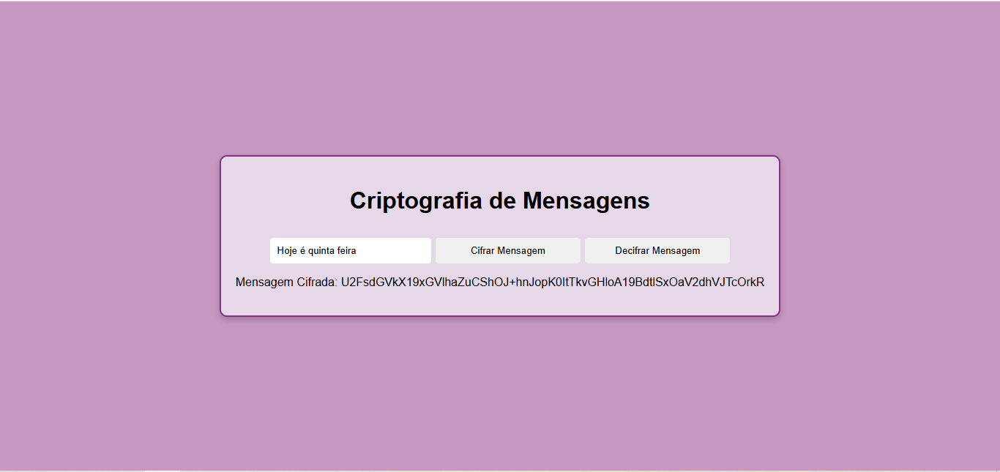
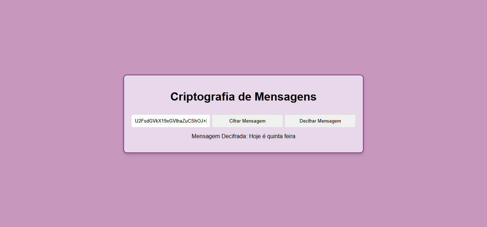

<h1 align="center">Criptografia Simetrica</h1>

## Project
This project was developed using the AES (Advanced Encryption Standard) algorithm to encrypt and decrypt text messages. The system provides a simple interface where users can input a message, encrypt it using a user-defined secret key, and later decrypt it using the same key.

Features:
- *Encrypt message:* Users can enter text and encrypt it using a secret key.
- *Decrypt message:* Users can input an encrypted message and decrypt it, as long as the key used for encryption is the same.

The encryption key is set as a fixed string ("minhaChaveSecreta"), but it can be easily modified to suit the user's needs.
## Layout
<div align="center">
  
  
</div>

## Technologies Used
- *Programming Language:* JavaScript - Backend / HTML - Frontend
- *Development Environment:* Visual Studio Code

## Code Author
```kotlin
fun main() {
    println("Code by Marcela Geremias!")
}