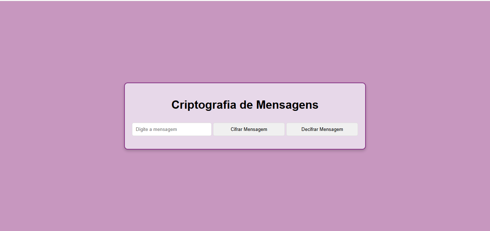

<h1 align="center">Criptografia Simetrica</h1>

## Project
This is a simple Tic-Tac-Toe application developed in Kotlin using Android Studio, with a responsive interface created in XML. The objective of the game is to allow two players to take turns, one using the "X" symbol and the other "O", aiming to form a row, column, or diagonal with three matching symbols to win the game.
## Layout
<div align="center">
  
</div>

## Technologies Used
- *Programming Language:* JavaScript
- *Development Environment:* Visual Studio Code

## Code Author
```kotlin
fun main() {
    println("Code by Marcela Geremias!")
}